# 🎮 Портфоліо Unity-розробника | Одеса, Україна

## 👋 Про мене
Unity-розробник з річним досвідом створення ігор та інтерактивних додатків. Маю досвід розробки казуальних ігор та AR-застосунків для освітніх цілей. Прагну розвиватися в геймдеві, працювати в команді над комерційними проєктами, вдосконалювати технічні й архітектурні навички.

## 🛠️ Технічний стек
- **Мова програмування:** C#
- **Асинхронне програмування:** UniTask
- **Архітектура та патерни:** MVC, Factory, Object Pool, Singleton, Service Locator, Command Pattern
- **DI-фреймворк:** Zenject (Extenject)
- **Плагіни та бібліотеки:** DoTween, R3 (Reactive Programming), UniTask
- **Принципи:** SOLID, DRY, KISS, YAGNI
- **Додаткові навички:** Git, базовий рівень SQL, початкові навички Photoshop і Blender

## 📚 Освіта та сертифікати
[Репозиторій з сертифікатами](https://github.com/HuGoxDP/certificates)

## 🚀 Проєкти

###  FlappyBird

[Link](https://github.com/HuGoxDP/Flappy-Bird.git)

**Опис:** Клон популярної гри FlappyBird, де гравець керує пташкою, якій потрібно оминати перешкоди у вигляді труб.

**Особливості:**
- Проста і зручна система керування
- Система підрахунку очок
- Плавна анімація та фізика
- Зручний інтерфейс користувача

  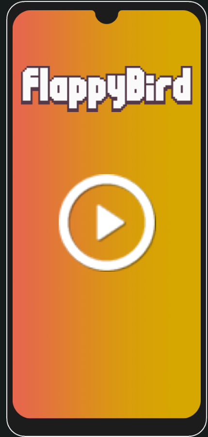
  
  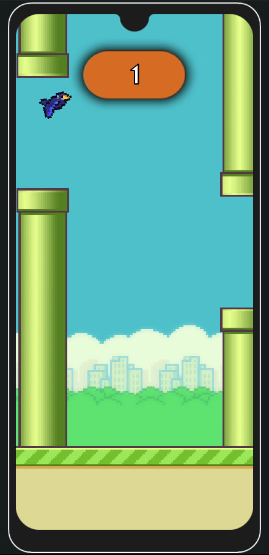
  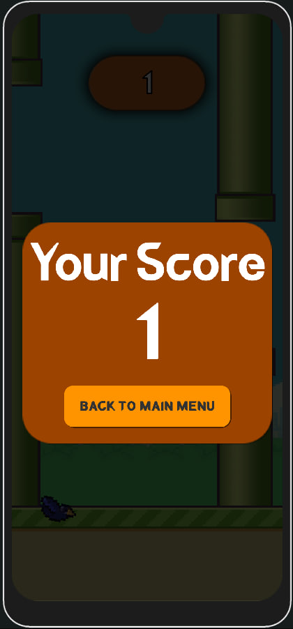

###  Physics AR

[Link](https://github.com/HuGoxDP/PhysicsAR.git)

**Опис:** AR Physics Simulation — це додаток доповненої реальності для навчальних підручників з фізики. Завдяки цьому додатку можна виконувати лабораторні роботи без потреби у фізичному обладнанні. Тригерами для запуску сцен слугують зображення зі сторінок книги.

**Особливості:**
- Інтеграція з AR-технологією Vuforia
- 2 типи сценаріїв: анімаційні та інтерактивні практичні
- Можливість зміни параметрів симуляції через інтерфейс
- Детальний опис кожного досліду
- 5 повноцінних симуляцій на тему "Сила тертя"
- Можливість перегляду результатів експерименту

  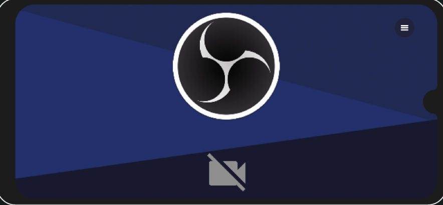
  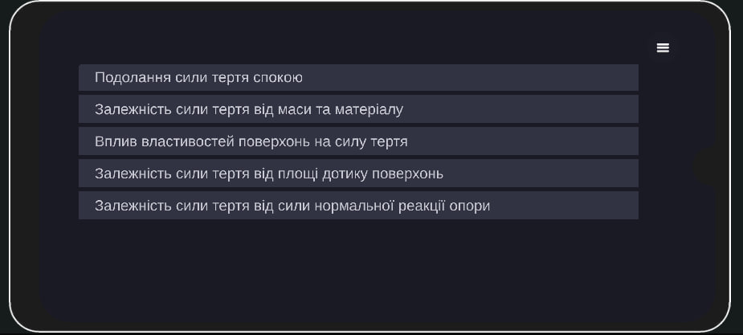

📸 Більше скріншотів додатку Physics AR

  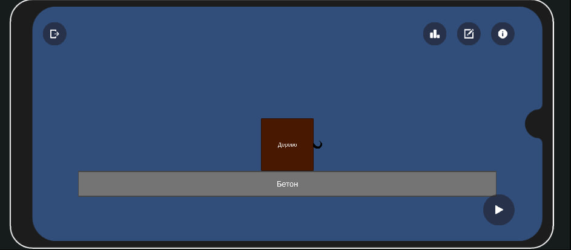
  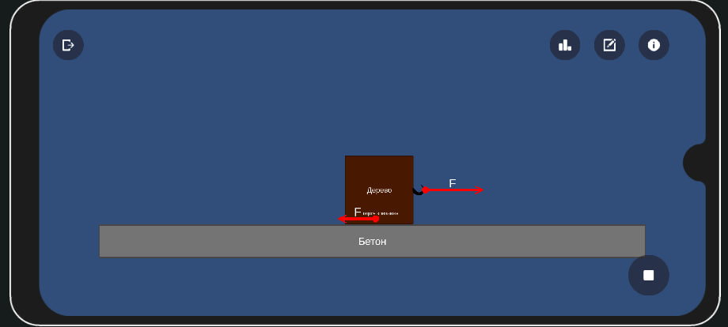
  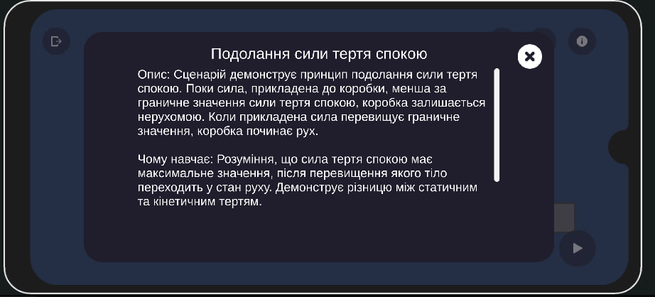
  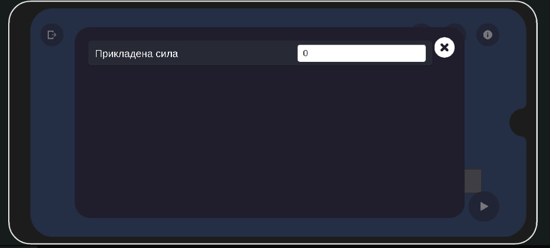
  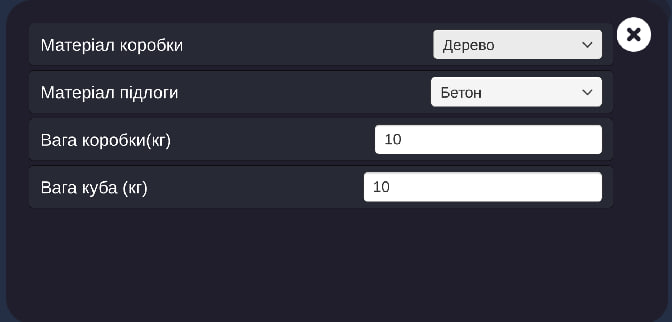
  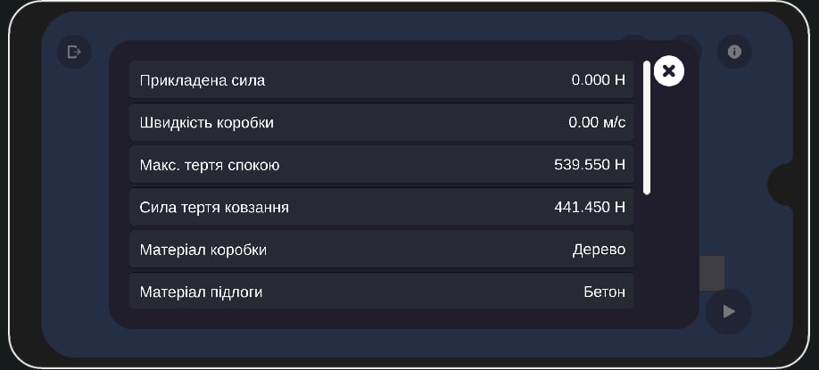
  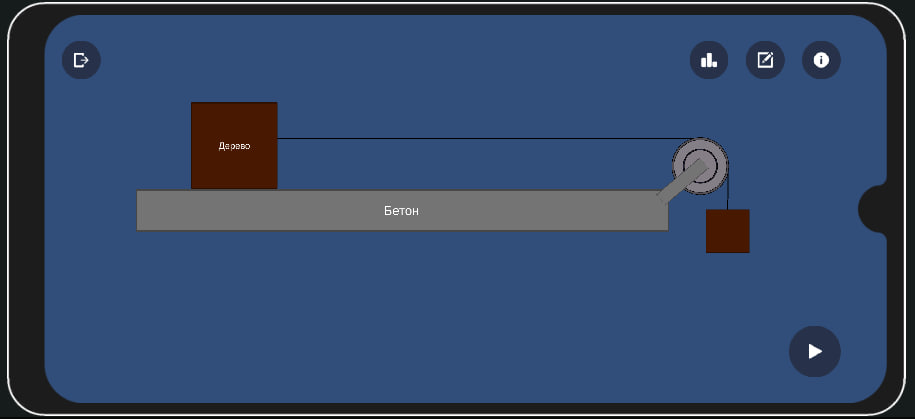
  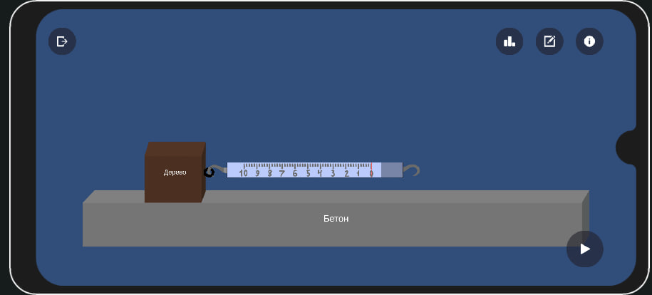
  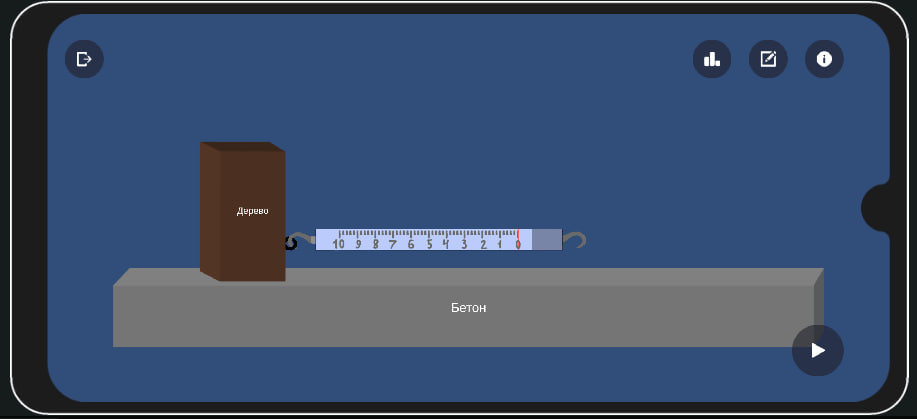
  

###  Meme Quiz (Memzy)

[Link](https://github.com/HuGoxDP/MemeQuize.git)

**Опис:** Інтерактивна квіз-гра, присвячена сучасній інтернет-культурі та мемам.

**Особливості:**
- 2 режими гри: виживання та обмежена кількість питань
- 3 типи питань: текстові, зображення, звукові
- Таймер, система життів, нарахування балів
- Підтримка кількох мов інтерфейсу
- Кастомний лоадер квіз-паків (JSON-пакети, що можна підключати/вимикати)
  

  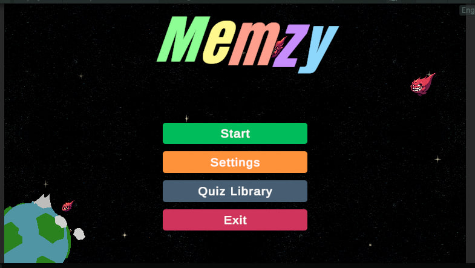
  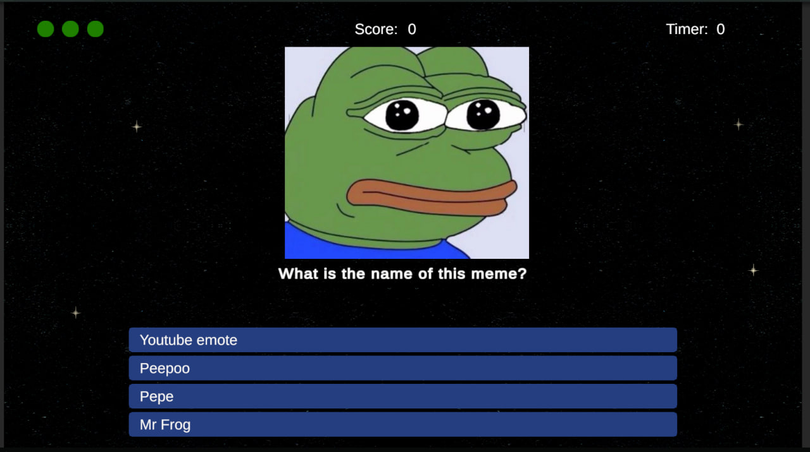

📸 Більше скріншотів додатку Physics AR

  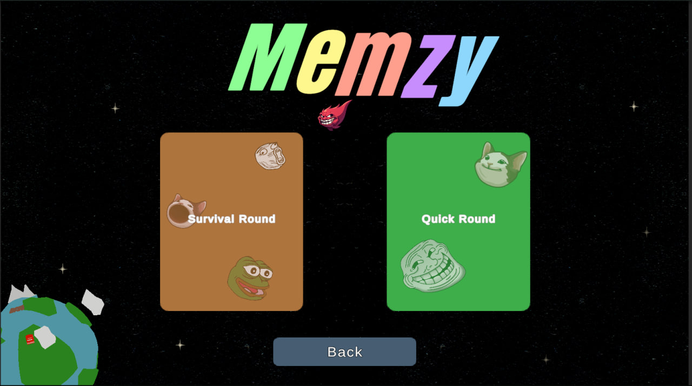
  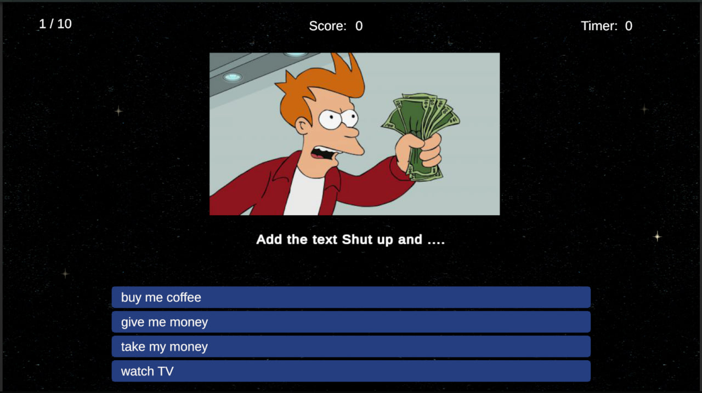
  
  
  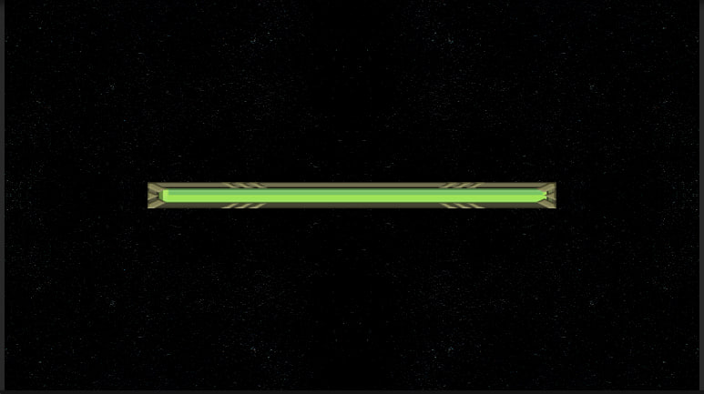
  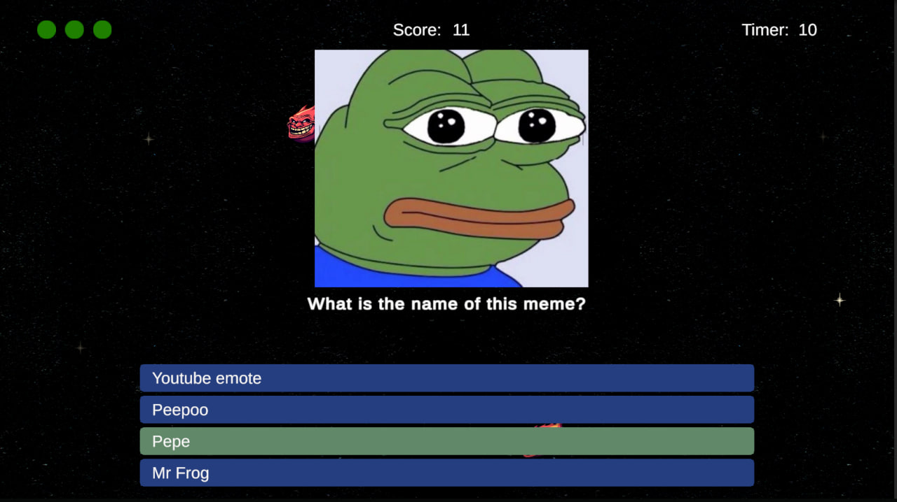
  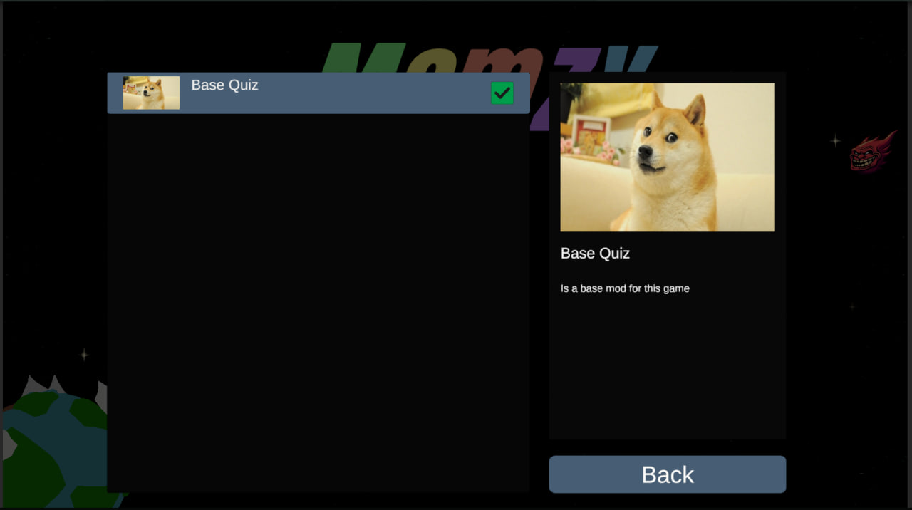
  
  
  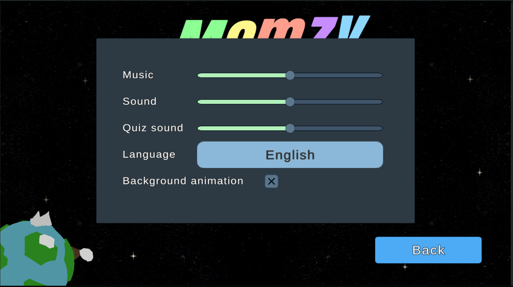

Other games

BetGame [Link](https://github.com/HuGoxDP/BetGame.git)

CodeMonkeyBuilderDefender [Link](https://github.com/HuGoxDP/CodeMonkeyBuilderDefender.git)

## 🎯 Мої цілі
- Розвиватися у геймдеві як Unity-розробник
- Працювати в команді над комерційними проєктами середньої та великої складності
- Вдосконалювати софт-скіли, архітектурні рішення та оптимізацію
- Розвивати навички в розробці багатокористувацьких механік

## 📫 Контакти
- **Місто:** Одеса, Україна
- **Telegram:** [@SpecWarrHuGo](https://t.me/SpecWarrHuGo)
- **Рівень англійської:** Pre-Intermediate
- **Формат роботи:** Віддалено або в офісі
