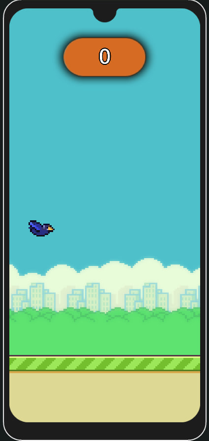

# Portfolio

## Certificates
https://github.com/HuGoxDP/certificates.git

## FlappyBird
клон FlappyBird - клон популярной игры FlappyBird. Где игрок играет за птичку, которой надо проходить препяствия, а именно трубы.
Главное меню
  
  Сцена игры
  
  Геймплей
  
  Меню результатов
  

## Physics AR
AR Physics Simulation — це додаток доповненої реальності для навчальних підручників з фізики. Завдяки цьому додатку можна виконувати лабораторні роботи без потреби у фізичному обладнанні. Тригерами для запуску сцен слугували зображення зі сторінок книги.
Меню Камеры - используя камеру можно отсканировать картинки в книге

меню выбора сценария

Сценарий номер 1

Запушеный сценарий номер 1

Меню описания сценария

Меню переменых которых можно менять

Есть 2 варианта переменых 
1 Текстовое поле в которое можно вприсать значение
2 Выпадаючий список, где можно выбрать опцию

Меню в котором указаны все переменные которые влияют на симуляцию
  
Сценарий номер 2

Сценарий номер 3

Сценарий номер 4

Сценарий номер 5

